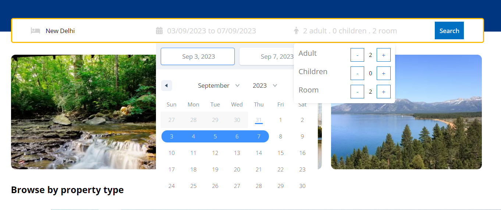
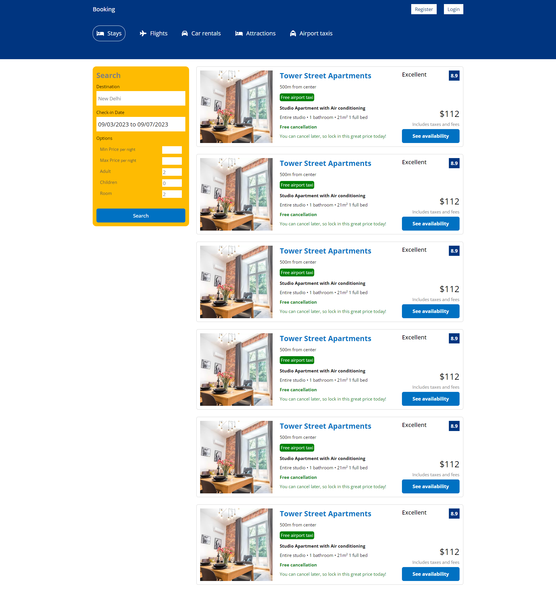

# BookingClone - Hotel Booking Website Clone

Welcome to BookingClone, a front-end clone of the popular hotel booking website Booking.com. This project is built using React.js and aims to replicate the functionality of searching for hotels based on specific dates, city, number of adults, children, and rooms.

## Table of Contents

- [Introduction](#bookingclone---hotel-booking-website-clone)
- [Features](#features)
- [Screenshots](#screenshots)
- [Installation](#installation)
- [Usage](#usage)
- [Contributing](#contributing)

## Features

- **Home Page:** Provides an overview of the website and its features.
- **Hotels List Page:** Displays a list of available hotels based on user search criteria.
- **Selected Hotel Page:** Shows detailed information about a selected hotel.
- **Hotel Search:** Users can search for hotels by specifying the city, check-in and check-out dates, number of adults, children, and rooms.

## Screenshots


_Home Page_


_Search_


_Hotels List Page_


_Selected Hotel Page_

## Installation

1. Clone the repository using the following command:

   ```bash
   git clone https://github.com/sadanmian/React-Booking
   ```

2. Navigate to the project directory:

   ```bash
   cd booking-clone
   ```

3. Install the required dependencies:

   ```bash
   npm install
   ```

## Usage

1. Start the development server:

   ```bash
   npm start
   ```

   This will launch the website in your default web browser. You can access it at `http://localhost:3000`.

2. On the home page, enter your desired city, check-in and check-out dates, number of adults, children, and rooms.

3. Click the search button to see the list of available hotels based on your search criteria.

4. Browse through the hotels, and click on a hotel to view more details.

## Contributing

Contributions are welcome! If you'd like to contribute to this project, please follow these steps:

1. Fork the repository.
2. Create a new branch for your feature or bug fix.
3. Make your changes and test them thoroughly.
4. Commit your changes with clear and concise commit messages.
5. Push your changes to your forked repository.
6. Create a pull request explaining your changes and their purpose.
